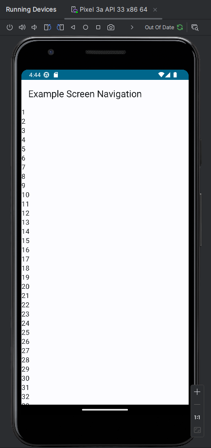
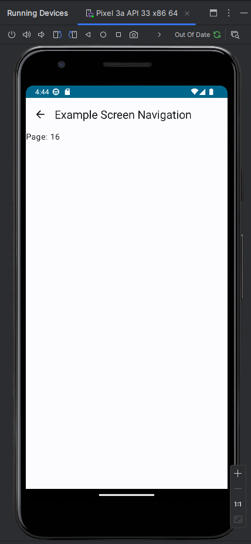

# multiple-screens-jetpack-compose-kotlin-android

By Hevanafa, 02-06-2023

A simplified version of the example from Google's Android Studio tutorial: [Page](https://developer.android.com/codelabs/basic-android-kotlin-compose-navigation).

This project includes:
- State management with ViewModel
- Navigation controller & the routes with an enum class
- Custom icon from [PNGWing.com](https://www.pngwing.com/en/free-png-mwlpb)

Some details are omitted for exercise, such as:
- Change **ScreenEnum** & try to make your own routing,
- Make the top bar title dynamic, you can use either page number or your own state property,
- Improve the UI, make it pretty & more professional.

## Preview

## Building

1. Start Android Studio Canary build,
2. Build menu --> Build Bundle / APK --> Build APK.